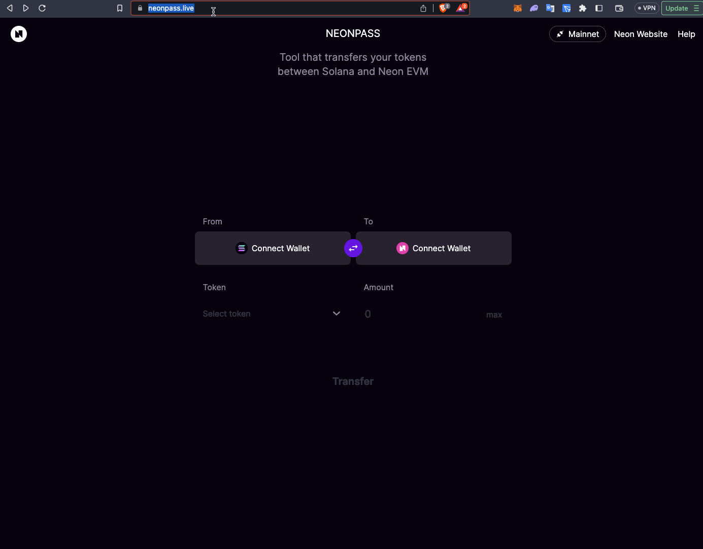

# Adding Liquidity

We hope this guide is useful to assist you to bringing liquidity to Sobal from Solana.

If you want to bring Liquidity to Sobal from another chain, please first bridge it to Solana and then follow this guide.


### Prerequisites 

Before you start, please ensure you have already the following:

1. Wallet on Solana (such as Phantom) with NEON tokens
2. Wallet supporting EVM with custom RPCs (such as Metamask)


### Steps 

* [Moving funds from Solana to NeonEVM via NeonPass](adding-liquidity.md#7f20)
* [Setting up Metamask for the Neon chain](adding-liquidity.md#31e2)
* [Depositing Liquidity to Sobal pools.](adding-liquidity.md#f96d)

## Moving funds from Solana to NeonEVM via NeonPass 

At the time of writing, NeonPass supports:

* Neon & Wrapped Neon
* Wrapped BTC (Sollet)
* Wrapped Ether (Wormhole)
* Wrapped SOL
* USDC
* USDT

### Steps 

1. Load the NeonPass website [https://neonpass.live](https://neonpass.live/) and connect your Solana and Neon wallets.\
   _ℹ️ Make sure you are connected to Mainnet in the top right hand corner._
2. Select your assets and the amount
3. Choose the transaction fee method (\*for NEON transactions only)
4. Press `Transfer` and repeat this process for any other tokens you wish to bridge across to Neon EVM.

<figure><figcaption></figcaption></figure>

## Setting up Metamask for the Neon chain 

1. Visit [https://www.coinlist.org](https://www.coinlist.org/)
2. Search for **Neon EVM**
3. Click “Add to Metamask” for the **Neon EVM MainNet** entry

<figure><figcaption></figcaption></figure>

## Depositing Liquidity to Sobal pools 

1. Visit [https://app.sobal.fi](https://app.sobal.fi/)
2. Select the Pool you wish to add liquidity to, in this example we’ll use the [**NEON/SOL**](https://app.sobal.fi/#/neon/pool/0xb04aba41dc9ed9b1c534b8239c4ffdfc526c5409000200000000000000000004) pool.
3. Click add liquidity and set the amount of tokens you wish to add\
   _⚠️ Pay careful attention to the price impact of the liquidity you’re adding. We recommend keeping it as balanced as possible (<0.01%). There is an `optimize` button you can use on the screen that will help you do so._
4. Sign the `approval` transactions and add liquidity!
5. All done! You can check your liquidity at anytime on the `Portfolio` tab of Sobal or opening the liquidity pool you participated in and scroll down.

<figure><figcaption></figcaption></figure>

### If you've managed to follow all the steps correctly, Congratulations you are now a Liquidity Provider!
